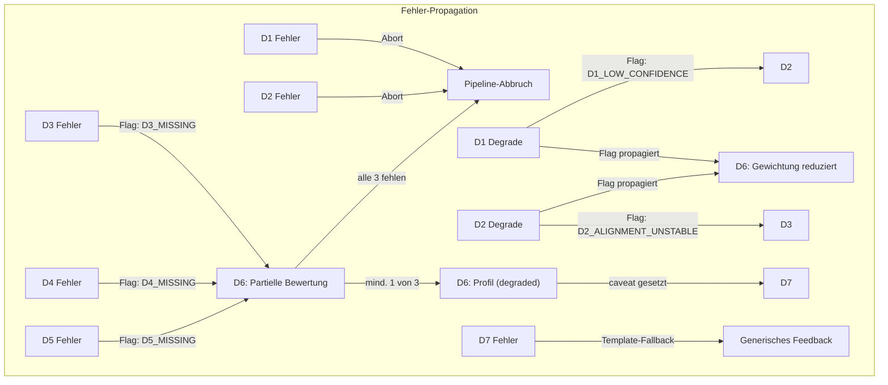

# Beta · B3 – Fehlerpropagation & Graceful Degradation

> **Beta-Leitfrage:** *Wie werden die sieben Gamma-Bausteine zu einem durchgängigen System verbunden?*
> **B3-Frage:** *Was passiert, wenn Bausteine versagen – und wie liefert die Pipeline trotzdem den bestmöglichen Output?*

> **Abhängigkeiten:** B3 baut auf B1 (Pipeline-Architektur) und B2 (Schnittstellenverträge) auf. B1 definiert *was* fließt, B2 spezifiziert *wie genau*, und B3 definiert *was passiert, wenn es schiefgeht*.

---

## 1  Warum Fehlerpropagation explizit modellieren?

### 1.1  Das Problem: Stille Fehler in ML-Pipelines

In einer klassischen Softwarepipeline ist ein Fehler offensichtlich: Eine Exception wird geworfen, ein HTTP-500 zurückgegeben, der Nutzer sieht eine Fehlermeldung. In einer **ML-Diagnosepipeline** wie Disce ist das fundamental anders:

- **Fehler erzeugen keine Exceptions, sondern falsche Ergebnisse.** Wenn D1 (ASR) ein Wort falsch transkribiert, crasht D2 (Alignment) nicht – es aligniert das falsche Wort phonetisch korrekt auf die falsche Stelle. D3 (Pronunciation) bewertet dann die Aussprache eines Wortes, das gar nicht gesagt wurde. D6 (Scoring) rechnet ein falsches CEFR-Level aus. Der Lerner bekommt falsches Feedback, und niemand merkt es.

- **Fehler kaskadieren nicht-linear.** Ein ASR-Fehler in D1 kann in D3 einen kleinen Effekt haben (ein Phonem-Score ist falsch), aber in D5 (Textdiagnostik) einen grossen: Das falsch transkribierte Wort wird als Grammatikfehler gewertet, was die Accuracy-Metrik verzerrt, was den CEFR-Level um eine Stufe verfaelscht.

- **Fehler haben unterschiedliche Schadensradien.** Ein instabiles Phonem-Alignment in D2 betrifft nur D3 und D4. Ein leeres Transkript in D1 zerstoert die gesamte Pipeline. Ein LLM-Guardrail-Fehler in D7 betrifft nur das Feedback, nicht das diagnostische Profil.

### 1.2  Das Ziel: Graceful Degradation statt Binary Fail

Disce verfolgt das Prinzip **"Lieber ein ehrlich eingeschraenktes Ergebnis als gar kein Ergebnis"**:

| Strategie | Bedeutung | Beispiel |
|-----------|-----------|---------|
| **Binary Fail** (vermeiden) | Alles oder nichts | ASR-Konfidenz niedrig: Pipeline bricht ab, kein Feedback |
| **Graceful Degradation** (anstreben) | Bestmoegliches Teilresultat mit Transparenz | ASR-Konfidenz niedrig: D6 gewichtet ASR-abhaengige Scores runter, D7 kommuniziert Einschraenkung, Lerner bekommt Feedback mit Caveat |

**Ausnahme:** Es gibt harte Abbruchbedingungen, bei denen kein sinnvolles Ergebnis moeglich ist (z.B. leeres Transkript, komplett stilles Audio). Diese werden in Abschnitt 4 definiert.

### 1.3  B3 im Beta-Dokumentenverbund

| Dokument | Definiert | B3 nutzt daraus |
|----------|-----------|-----------------|
| **B1** End-to-End-Pipeline | DAG-Struktur, Stufenaufteilung | Welche Stufen sequenziell, welche parallel: bestimmt Fehlerpfade |
| **B2** Schnittstellenvertraege | Pydantic-Schemata, Invarianten, `DegradationFlag` | Die Fehler-Trigger-Punkte und Flag-Taxonomie |
| **B3** (dieses Dokument) | Fehler-Taxonomie, Propagationsregeln, Degradationspfade | -- |
| **B4** (geplant) | Deployment & Betrieb | Monitoring, Alerting, Error-Dashboards |

---

## 2  Fehler-Taxonomie: Fuenf Klassen

Nicht jeder Fehler ist gleich. Disce unterscheidet fuenf Fehlerklassen nach **Ursache**, **Erkennbarkeit** und **Behandelbarkeit**:

### 2.1  Uebersicht

| Klasse | Name | Ursache | Erkennbar? | Behandlung | Beispiel |
|--------|------|---------|------------|------------|---------|
| **F1** | Hard Failure | Infrastruktur / Code-Fehler | Ja (Exception) | Retry oder Abort | OOM bei Whisper, Kaldi-Binary nicht gefunden |
| **F2** | Input-Fehler | Ungueltiger Input | Ja (Validierung) | Abort mit Nutzer-Feedback | Audio stumm, < 0.5s, kein WAV-Format |
| **F3** | Qualitaetsdegradation | ML-Modell unsicher | Teilweise (Confidence) | Degrade + Flag | ASR-Konfidenz < 0.3, Alignment instabil |
| **F4** | Stille Verfaelschung | ML-Modell falsch bei hoher Confidence | Nein (inhaerent) | Statistische Absicherung | ASR transkribiert "Haus" als "Maus" mit confidence 0.95 |
| **F5** | Downstream-Inkonsistenz | Propagierter Upstream-Fehler | Teilweise (Plausibilitaetspruefung) | Cross-Validation | D5 findet 12 Grammatikfehler bei einem 5-Wort-Satz |

### 2.2  Detaillierung der Klassen

#### F1 – Hard Failure

**Natur:** Technische Fehler, die nichts mit der Sprachanalyse zu tun haben. Der Baustein konnte gar nicht ausgefuehrt werden.

**Erkennungsmechanismus:**
- Exception/Error im Python-Prozess
- Timeout (pro Baustein konfigurierbar, s. Abschnitt 7)
- Container-Crash / OOM-Kill

**Beispiele:**
- Whisper-Modell nicht geladen (GPU-OOM)
- MFA-Binary nicht im PATH
- Kaldi-GOP-Skript gibt Exit-Code != 0
- LanguageTool-Server nicht erreichbar
- LLM-API-Timeout

**Reaktion:** Retry (max 1x, konfigurierbar) -> bei erneutem Failure: Stage als `FAILED` markieren, Fehler in `StageResult.error` protokollieren, Orchestrator entscheidet ueber Weiterlauf (s. Abschnitt 5).

```python
class HardFailurePolicy(BaseModel):
    """Konfiguration fuer Hard-Failure-Behandlung pro Stage."""
    
    stage: str = Field(..., description="z.B. 'd1_asr'")
    max_retries: int = Field(default=1, ge=0, le=3)
    retry_delay_s: float = Field(default=2.0, gt=0)
    timeout_s: float = Field(..., gt=0, description="Stage-Timeout")
    
    # Kann die Pipeline ohne diesen Baustein weiterlaufen?
    is_critical: bool = Field(
        ...,
        description="True = Pipeline-Abbruch bei Failure. False = Degradation moeglich"
    )

HARD_FAILURE_POLICIES = {
    "d1_asr":           HardFailurePolicy(stage="d1_asr",           timeout_s=30, is_critical=True),
    "d2_alignment":     HardFailurePolicy(stage="d2_alignment",     timeout_s=45, is_critical=True),
    "d3_pronunciation": HardFailurePolicy(stage="d3_pronunciation", timeout_s=30, is_critical=False),
    "d4_prosody":       HardFailurePolicy(stage="d4_prosody",       timeout_s=20, is_critical=False),
    "d5_text":          HardFailurePolicy(stage="d5_text",          timeout_s=15, is_critical=False),
    "d6_scoring":       HardFailurePolicy(stage="d6_scoring",       timeout_s=10, is_critical=True),
    "d7_coaching":      HardFailurePolicy(stage="d7_coaching",      timeout_s=30, is_critical=False),
}
```

**Begruendung der Kritikalitaets-Einstufungen:**
- **D1 (kritisch):** Ohne Transkript kann nichts Sinnvolles passieren.
- **D2 (kritisch):** Ohne Alignment keine Phonem-Scores, keine zeitlichen Zuordnungen. D4 und D5 koennten theoretisch mit Whisper-Timestamps als Fallback arbeiten, aber im MVP akzeptieren wir diesen Abbruch.
- **D3, D4, D5 (nicht kritisch):** Der Join-Punkt (B2, Abschnitt 6.4) erlaubt partielle Ergebnisse. Mindestens 1 von 3 muss vorliegen (Invariante I-4.1).
- **D6 (kritisch):** Ohne diagnostisches Profil kann D7 kein Feedback generieren. Ein Profil ohne D7 waere nutzlos fuer den Lerner.
- **D7 (nicht kritisch):** Wenn das LLM ausfaellt, kann ein Template-basiertes Fallback-Feedback erzeugt werden (s. Abschnitt 6.7).

#### F2 – Input-Fehler

**Natur:** Der Input in die Pipeline (oder in eine Stage) entspricht nicht den Mindestanforderungen.

**Erkennungsmechanismus:**
- Pydantic-Validierung am Pipeline-Eingang
- Vorab-Checks (Audio-Analyse) vor D1

```python
class AudioInputValidator(BaseModel):
    """Validierung des Audio-Inputs vor Pipeline-Start."""
    
    min_duration_s: float = Field(default=0.5, description="Mindestlaenge")
    max_duration_s: float = Field(default=120.0, description="Maximallaenge")
    min_rms_db: float = Field(default=-55.0, description="Mindest-Lautstaerke in dB")
    required_sample_rate: int = Field(default=16000)
    required_channels: int = Field(default=1, description="Mono")
    required_format: str = Field(default="wav")

class InputValidationResult(BaseModel):
    """Ergebnis der Input-Validierung."""
    
    is_valid: bool
    errors: List[str] = Field(default_factory=list)
    warnings: List[str] = Field(default_factory=list)
    audio_stats: Optional["AudioStats"] = None

class AudioStats(BaseModel):
    """Technische Audio-Statistiken fuer Diagnose."""
    
    duration_s: float
    sample_rate: int
    channels: int
    rms_db: float
    clipping_ratio: float = Field(
        ge=0.0, le=1.0,
        description="Anteil geclippter Samples"
    )
    snr_estimate_db: Optional[float] = None
```

**Typische Input-Fehler und Reaktionen:**

| Fehler | Erkennung | Reaktion |
|--------|-----------|---------|
| Audio stumm (RMS < -55 dB) | `AudioStats.rms_db` | Abort + Nutzer-Meldung: "Kein Audio erkannt" |
| Audio zu kurz (< 0.5s) | `AudioStats.duration_s` | Abort + Nutzer-Meldung: "Aufnahme zu kurz" |
| Audio zu lang (> 120s) | `AudioStats.duration_s` | Abort + Nutzer-Meldung: "Aufnahme kuerzen" |
| Falsches Format | Dateiheader-Check | Abort + Nutzer-Meldung: "Bitte WAV-Format" |
| Starkes Clipping (> 20%) | `AudioStats.clipping_ratio` | Warning-Flag, Pipeline laeuft weiter |
| Niedriges SNR (< 10 dB) | `AudioStats.snr_estimate_db` | Warning-Flag, Pipeline laeuft weiter |

**Wichtig:** Input-Fehler fuehren immer zu sofortigem Abort mit einer **verstaendlichen Nutzer-Meldung**. Kein Degradation-Versuch, weil das Eingangsmaterial fundamental unbrauchbar ist.

#### F3 – Qualitaetsdegradation

**Natur:** Ein Baustein hat ein Ergebnis produziert, aber seine eigene Confidence ist niedrig. Das Ergebnis ist vorhanden, aber unzuverlaessig.

**Erkennungsmechanismus:**
- Modell-interne Confidence-Scores (Whisper, MFA, GOP)
- Heuristische Schwellenwerte (konfigurierbar)

```python
class QualityThresholds(BaseModel):
    """Schwellenwerte fuer Qualitaetsdegradation pro Stage."""
    
    # D1 – ASR
    d1_confidence_warn: float = Field(default=0.5, description="Warning-Schwelle")
    d1_confidence_degrade: float = Field(default=0.3, description="Degradation-Schwelle")
    
    # D2 – Alignment
    d2_alignment_confidence_warn: float = Field(default=0.65)
    d2_alignment_confidence_degrade: float = Field(default=0.5)
    d2_divergence_ratio_warn: float = Field(
        default=0.2,
        description="Anteil Phoneme mit MFA/WebMAUS-Divergenz"
    )
    
    # D3 – Pronunciation
    d3_min_phones_scored: int = Field(
        default=5,
        description="Mindestanzahl bewerteter Phoneme fuer robustes Scoring"
    )
    
    # D4 – Prosodie
    d4_min_words_for_rhythm: int = Field(
        default=5,
        description="Mindestanzahl Woerter fuer Rhythmus-Metriken"
    )
    
    # D5 – Text
    d5_min_words_for_caf: int = Field(
        default=3,
        description="Mindestanzahl Woerter fuer CAF-Analyse"
    )
```

**Degradationsregel:** Wenn eine Quality-Schwelle unterschritten wird, passiert Folgendes:
1. Der Baustein produziert *trotzdem* seinen Output
2. Ein `DegradationFlag` (definiert in B2) wird in den Output geschrieben
3. Der Orchestrator propagiert das Flag zum `AssessmentEnvelope`
4. D6 beruecksichtigt das Flag bei der Gewichtung
5. D7 kommuniziert die Einschraenkung an den Lerner

#### F4 – Stille Verfaelschung

**Natur:** Das heimtueckischste Problem. Ein ML-Modell liefert ein falsches Ergebnis mit hoher Confidence. Kein Mechanismus im normalen Pipeline-Lauf kann das erkennen.

**Beispiele:**
- Whisper transkribiert "Kueche" als "Kirche" mit confidence 0.92
- GOP bewertet ein korrekt ausgesprochenes /c_c/ als fehlerhaft (0.15), weil das Alignment um 40ms verschoben ist
- LanguageTool markiert einen korrekten Satz als grammatisch falsch (False Positive)

**Erkennungsstrategien (Defense-in-Depth):**

| Strategie | Wann | Wie | Erkennungsrate |
|-----------|------|-----|----------------|
| **Cross-Domain-Plausibilitaet** | D6 | D3 sagt "perfekte Aussprache", aber D5 findet massive Grammatikfehler: Inkonsistenz-Flag | Mittel |
| **Statistische Outlier-Detection** | D6 | Ein Feature ist > 3 sigma vom Erwartungswert fuer das CEFR-Level: Plausibilitaets-Warning | Niedrig-Mittel |
| **Dual-Model-Verifikation** | D2, D3 | MFA vs. WebMAUS (D2), Kaldi-GOP vs. CTC-GOP (D3): Bei Divergenz: Confidence-Abwertung | Hoch fuer D2/D3 |
| **Offline-Evaluation** | Post-hoc | Human-annotiertes Gold-Corpus zum regelmaessigen Benchmarking | Langfristig hoch |

**Realistische Einschaetzung:** F4-Fehler sind inhaerent nicht vollstaendig eliminierbar. Disce akzeptiert das und setzt auf:
1. **Transparenz** (Confidence-Scores und Caveats im Feedback)
2. **Redundanz** (Dual-Stack in D2, Dual-GOP in D3)
3. **Statistische Robustheit** (Aggregation ueber viele Phoneme/Features statt Einzelwert-Vertrauen)
4. **Kontinuierliches Monitoring** (Offline-Eval-Pipelines, s. B4)

#### F5 – Downstream-Inkonsistenz

**Natur:** Ein Upstream-Fehler (moeglicherweise F3 oder F4) erzeugt downstream einen implausiblen Zustand, der durch Plausibilitaetspruefungen erkennbar ist.

**Erkennungsmechanismus:** Cross-Validierung am Join-Punkt (D6-Input) und im D6-Scoring selbst.

```python
class PlausibilityCheck(BaseModel):
    """Eine einzelne Plausibilitaetspruefung."""
    
    check_id: str
    description: str
    severity: Literal["warning", "degrade", "abort"]
    triggered: bool = False
    details: Optional[str] = None

PLAUSIBILITY_CHECKS = [
    PlausibilityCheck(
        check_id="PC-1",
        description="Wort-Count-Konsistenz: D3 vs. D5",
        severity="warning",
        # D3.word_count und D5.total_words sollten +/-10% uebereinstimmen
    ),
    PlausibilityCheck(
        check_id="PC-2",
        description="Pronunciation vs. Grammar: Extremwert-Divergenz",
        severity="degrade",
        # D3.overall_score > 90 aber D5.accuracy.error_rate > 0.5: unplausibel
    ),
    PlausibilityCheck(
        check_id="PC-3",
        description="Fehlerrate vs. Textlaenge",
        severity="warning",
        # D5.error_count > D5.total_words: mehr Fehler als Woerter
    ),
    PlausibilityCheck(
        check_id="PC-4",
        description="Prosodie-Score vs. Textlaenge",
        severity="warning",
        # D4 produziert robustes Ergebnis, aber Input < 5 Woerter
    ),
    PlausibilityCheck(
        check_id="PC-5",
        description="CEFR-Level vs. Einzeldimensionen: Maximale Spreizung",
        severity="degrade",
        # Wenn eine Dimension A1 und eine andere C1 ist: Caveat setzen
    ),
]
```

---

## 3  Der Fehler-DAG: Propagationspfade

### 3.1  Welcher Fehler betrifft wen?

Die Pipeline-Struktur (B1) bestimmt, welche Downstream-Bausteine von einem Upstream-Fehler betroffen sind:

```
Fehler in D1 -> betrifft: D2, D3, D4, D5, D6, D7  (alles)
Fehler in D2 -> betrifft: D3, D4*, D5*, D6, D7     (*partiell: nur Zeitstempel)
Fehler in D3 -> betrifft: D6 (Pronunciation-Score), D7 (Pronunciation-Feedback)
Fehler in D4 -> betrifft: D6 (Prosodie-Score), D7 (Prosodie-Feedback)
Fehler in D5 -> betrifft: D6 (Text-Scores), D7 (Grammatik/Lexik-Feedback)
Fehler in D6 -> betrifft: D7 (Coaching basiert auf falschem Profil)
Fehler in D7 -> betrifft: nur den Lerner-Output (diagnostisches Profil in D6 bleibt korrekt)
```

### 3.2  Schadensradius-Matrix

| Fehler-Quelle | D2 | D3 | D4 | D5 | D6 | D7 | Schadensradius |
|---------------|----|----|----|----|----|----|----------------|
| **D1 Fail** | X | X | X | X | X | X | **Total** |
| **D1 Degrade** | ~ | ~ | ~ | ~ | ~ | ~ | **Global-partiell** |
| **D2 Fail** | -- | X | ~ | ~ | X | ~ | **Hoch** |
| **D2 Degrade** | -- | ~ | o | o | ~ | o | **Mittel** |
| **D3 Fail** | -- | -- | -- | -- | ~ | ~ | **Lokal** |
| **D4 Fail** | -- | -- | -- | -- | ~ | ~ | **Lokal** |
| **D5 Fail** | -- | -- | -- | -- | ~ | ~ | **Lokal** |
| **D6 Fail** | -- | -- | -- | -- | -- | X | **Terminal** |
| **D7 Fail** | -- | -- | -- | -- | -- | -- | **Terminal (Fallback moeglich)** |

**Legende:** X = voll betroffen, ~ = partiell betroffen (mit Flag), o = minimal/nicht betroffen

### 3.3  Propagationspfade als Mermaid-Diagramm



---

## 4  Harte Abbruchbedingungen (Stop-the-World)

### 4.1  Wann wird die Pipeline abgebrochen?

Ein Pipeline-Abbruch ist die letzte Eskalationsstufe. Er wird ausgeloest, wenn kein sinnvolles Ergebnis mehr moeglich ist:

| # | Bedingung | Ausloeser | Nutzer-Meldung |
|---|-----------|----------|----------------|
| **ABORT-1** | Audio ungueltig | F2: Input-Validierung | "Bitte nimm die Aufnahme erneut auf." |
| **ABORT-2** | Transkript leer | D1 produziert leeren String | "Wir konnten keine Sprache erkennen. Bitte sprich lauter oder in einer ruhigeren Umgebung." |
| **ABORT-3** | D1 Hard Failure | F1: Whisper-Crash nach Retry | "Es gab ein technisches Problem. Bitte versuche es erneut." |
| **ABORT-4** | D2 Hard Failure | F1: MFA-Crash nach Retry | "Es gab ein technisches Problem. Bitte versuche es erneut." |
| **ABORT-5** | Alle Analysen fehlen | D3 + D4 + D5 alle FAILED | "Wir konnten deine Sprache diesmal nicht vollstaendig analysieren. Bitte versuche es erneut." |
| **ABORT-6** | D6 Hard Failure | F1: Scoring-Crash nach Retry | "Es gab ein technisches Problem. Bitte versuche es erneut." |

### 4.2  Abort-Implementierung

```python
from enum import Enum
from typing import Optional
from pydantic import BaseModel, Field

class AbortReason(str, Enum):
    AUDIO_INVALID = "audio_invalid"
    TRANSCRIPT_EMPTY = "transcript_empty"
    D1_HARD_FAILURE = "d1_hard_failure"
    D2_HARD_FAILURE = "d2_hard_failure"
    ALL_ANALYSES_FAILED = "all_analyses_failed"
    D6_HARD_FAILURE = "d6_hard_failure"

class PipelineAbort(BaseModel):
    """Repraesentiert einen Pipeline-Abbruch."""
    
    reason: AbortReason
    stage: str = Field(..., description="Stage, in der der Abbruch ausgeloest wurde")
    technical_detail: str = Field(..., description="Technische Fehlerbeschreibung (intern)")
    user_message_key: str = Field(
        ...,
        description="i18n-Key fuer Nutzer-Meldung, z.B. 'error.audio_invalid'"
    )
    recoverable: bool = Field(
        ...,
        description="Kann der Nutzer das Problem selbst loesen? (z.B. nochmal aufnehmen)"
    )

ABORT_MESSAGES = {
    AbortReason.AUDIO_INVALID: {
        "key": "error.audio_invalid",
        "recoverable": True,
    },
    AbortReason.TRANSCRIPT_EMPTY: {
        "key": "error.transcript_empty",
        "recoverable": True,
    },
    AbortReason.D1_HARD_FAILURE: {
        "key": "error.technical",
        "recoverable": True,
    },
    AbortReason.D2_HARD_FAILURE: {
        "key": "error.technical",
        "recoverable": True,
    },
    AbortReason.ALL_ANALYSES_FAILED: {
        "key": "error.analysis_failed",
        "recoverable": True,
    },
    AbortReason.D6_HARD_FAILURE: {
        "key": "error.technical",
        "recoverable": False,  # Deutet auf Systemproblem hin
    },
}
```

---

## 5  Der Orchestrator: Entscheidungslogik

### 5.1  Orchestrator-Rolle

Der Orchestrator (eingefuehrt in B1) ist die zentrale Instanz, die entscheidet, wie auf Fehler reagiert wird. Er kennt:
- Die `HardFailurePolicy` jeder Stage
- Die aktuellen `DegradationFlags`
- Die Ergebnisse der `PlausibilityChecks`
- Die Invarianten aus B2

### 5.2  Entscheidungsalgorithmus

```python
from typing import Dict, List, Optional
from enum import Enum

class OrchestratorDecision(str, Enum):
    CONTINUE = "continue"                        # Normal weiter
    CONTINUE_DEGRADED = "continue_degraded"      # Weiter, aber mit Flag
    SKIP_STAGE = "skip_stage"                    # Stage ueberspringen
    ABORT = "abort"                              # Pipeline-Abbruch

def decide_on_stage_result(
    stage: str,
    result: "StageResult",
    policies: Dict[str, HardFailurePolicy],
    current_flags: List["DegradationFlag"],
    active_stages: Dict[str, "StageResult"],
) -> OrchestratorDecision:
    """
    Zentrale Entscheidungsfunktion des Orchestrators.
    
    Wird nach jeder Stage aufgerufen und entscheidet,
    wie die Pipeline weiterlaufen soll.
    """
    policy = policies[stage]
    
    # Fall 1: Hard Failure
    if result.status == StageStatus.FAILED:
        if policy.is_critical:
            return OrchestratorDecision.ABORT
        else:
            return OrchestratorDecision.SKIP_STAGE
    
    # Fall 2: Erfolg, aber mit Degradation-Flags
    if result.status == StageStatus.COMPLETED:
        new_flags = extract_degradation_flags(stage, result)
        if new_flags:
            current_flags.extend(new_flags)
            return OrchestratorDecision.CONTINUE_DEGRADED
        return OrchestratorDecision.CONTINUE
    
    # Fall 3: Unbekannter Status
    raise ValueError(f"Unexpected status: {result.status} for stage {stage}")

def check_join_point_viability(
    d3_result: Optional["StageResult"],
    d4_result: Optional["StageResult"],
    d5_result: Optional["StageResult"],
) -> OrchestratorDecision:
    """
    Prueft am Join-Punkt (vor D6), ob genug Analyse-Ergebnisse vorliegen.
    Implementiert Invariante I-4.1 aus B2.
    """
    available = sum(1 for r in [d3_result, d4_result, d5_result]
                    if r is not None and r.status == StageStatus.COMPLETED)
    
    if available == 0:
        return OrchestratorDecision.ABORT  # ABORT-5
    
    return OrchestratorDecision.CONTINUE_DEGRADED if available < 3 else OrchestratorDecision.CONTINUE
```

### 5.3  Entscheidungsbaum (visuell)

```
Stage-Ergebnis eingetroffen
|
+-- Status = FAILED?
|   +-- Ja + is_critical = True  -> ABORT
|   +-- Ja + is_critical = False -> SKIP_STAGE
|       +-- Am Join-Punkt: Mindestens 1 von 3 vorhanden?
|           +-- Nein -> ABORT (ABORT-5)
|           +-- Ja   -> CONTINUE_DEGRADED (Flags setzen)
|
+-- Status = COMPLETED?
|   +-- Degradation-Flags vorhanden? 
|   |   +-- Ja  -> CONTINUE_DEGRADED
|   |   +-- Nein -> CONTINUE
|   +-- Plausibilitaetschecks fehlgeschlagen?
|       +-- Severity = abort -> ABORT (selten, z.B. totale Inkonsistenz)
|       +-- Severity = degrade -> CONTINUE_DEGRADED (Caveat setzen)
|       +-- Severity = warning -> CONTINUE (Warning loggen)
|
+-- Status = sonstiges -> ERROR (sollte nie auftreten)
```

---

## 6  Degradationspfade pro Domaene: Was passiert konkret?

### 6.1  D1 (ASR) -> Degradation

| Szenario | Ausloeser | Flag | Auswirkung auf Downstream |
|----------|----------|------|--------------------------|
| Niedrige Konfidenz | `mean(word.confidence) < 0.3` | `D1_LOW_CONFIDENCE` | D6 reduziert Gewichtung aller D1-abhaengigen Features um 50% |
| Teilweise niedrige Konfidenz | Einzelne Woerter < 0.2 | `D1_LOW_CONFIDENCE` (lokal) | D3 markiert betroffene Phonem-Scores als unsicher |
| Sprache nicht Deutsch | `language != "de"` | Warning (kein Flag) | Pipeline laeuft, aber alle Modelle sind fuer Deutsch trainiert: erhoehte Fehlerwahrscheinlichkeit |

**D1-Degradation in der Praxis:**

```python
def assess_d1_quality(d1_output: "D1Output", thresholds: QualityThresholds) -> List["DegradationFlag"]:
    """Bewertet D1-Output-Qualitaet und erzeugt Degradation-Flags."""
    flags = []
    
    # Gesamtkonfidenz
    mean_conf = sum(w.confidence for w in d1_output.words) / len(d1_output.words)
    if mean_conf < thresholds.d1_confidence_degrade:
        flags.append(DegradationFlag.D1_LOW_CONFIDENCE)
    
    # Wort-Level-Analyse
    low_conf_words = [w for w in d1_output.words if w.confidence < 0.2]
    if len(low_conf_words) > len(d1_output.words) * 0.3:
        # > 30% der Woerter mit sehr niedriger Konfidenz
        flags.append(DegradationFlag.D1_LOW_CONFIDENCE)
    
    return flags
```

### 6.2  D2 (Alignment) -> Degradation

| Szenario | Ausloeser | Flag | Auswirkung auf Downstream |
|----------|----------|------|--------------------------|
| Instabiles Alignment | `alignment_confidence_overall < 0.5` | `D2_ALIGNMENT_UNSTABLE` | D3: GOP-Scores erhalten Unsicherheits-Marker; D6: Pronunciation-Gewichtung reduziert |
| MFA/WebMAUS-Divergenz | `> 20%` Phoneme mit Divergenz > 30ms | `D2_ALIGNMENT_UNSTABLE` | Wie oben |
| Zu wenig Woerter | `len(words) < 3` | `INSUFFICIENT_MATERIAL` | D4: Rhythmus-Metriken nicht berechenbar; D5: CAF-Analyse reduziert |

**Fallback bei D2-Failure:** Wenn MFA komplett ausfaellt, existiert ein theoretischer Fallback auf Whisper-Timestamps:

```python
class D2FallbackStrategy:
    """
    Fallback: Wenn MFA komplett ausfaellt, nutze Whisper-Timestamps.
    
    Einschraenkungen:
    - Keine Phonem-Ebene, daher kann D3 (Pronunciation) nicht laufen
    - Nur Wort-Ebene, daher bekommt D4 (Prosodie) grobe Zeitstempel
    - D5 (Text) ist nicht betroffen (braucht nur Transkript)
    
    Status: NICHT implementiert im MVP. D2-Failure = Pipeline-Abort.
    Geplant fuer v1.1 als Degradation-Pfad.
    """
    
    @staticmethod
    def create_d2_fallback_from_whisper(d1_output: "D1Output") -> "D2Output":
        """
        Erzeugt einen pseudo-D2-Output aus Whisper-Zeitstempeln.
        Alle Woerter erhalten alignment_confidence = FALLBACK.
        Phonem-Listen sind leer, daher wird D3 uebersprungen.
        """
        raise NotImplementedError("Geplant fuer v1.1")
```

### 6.3  D3 (Pronunciation) -> Degradation / Failure

| Szenario | Ausloeser | Flag | Auswirkung auf Downstream |
|----------|----------|------|--------------------------|
| D3 komplett ausgefallen | F1: Kaldi-Crash | `D3_MISSING` | D6: Profil ohne Pronunciation-Dimension; D7: Kein Aussprache-Feedback |
| D3 teilweise unsicher | GOP-Scores fuer > 50% der Phoneme < Schwelle | `D3_LOW_CONFIDENCE` | D6: Pronunciation-Score mit hoher Unsicherheit; D7: Aussprache-Feedback mit Caveat |
| Zu wenig Phoneme bewertet | < 5 Phoneme scored | `D3_LOW_CONFIDENCE` | Wie oben |

### 6.4  D4 (Prosodie) -> Degradation / Failure

| Szenario | Ausloeser | Flag | Auswirkung auf Downstream |
|----------|----------|------|--------------------------|
| D4 komplett ausgefallen | F1: Parselmouth-Crash | `D4_MISSING` | D6: Profil ohne Prosodie-Dimension; D7: Kein Prosodie-Feedback |
| Zu kurze Aeusserung | < 5 Woerter: Rhythmus-Metriken unzuverlaessig | `INSUFFICIENT_MATERIAL` | D6: Prosodie-Score als "insufficient" markiert, nicht in CEFR-Berechnung einbezogen |
| F0-Extraktion fehlgeschlagen | Kein voiced Segment erkannt | `D4_MISSING` | Wie "komplett ausgefallen" |

### 6.5  D5 (Textdiagnostik) -> Degradation / Failure

| Szenario | Ausloeser | Flag | Auswirkung auf Downstream |
|----------|----------|------|--------------------------|
| D5 komplett ausgefallen | F1: LanguageTool/spaCy-Crash | `D5_MISSING` | D6: Profil ohne Grammatik/Lexik-Dimension; D7: Kein Grammatik-Feedback |
| Zu wenig Material | < 3 Woerter | `INSUFFICIENT_MATERIAL` | D6: CAF-Scores als "insufficient" markiert |
| LanguageTool unreachable, spaCy ok | Partieller F1 | Warning | Grammatik-Fehler fehlen, aber Complexity + Fluency verfuegbar |

### 6.6  D6 (Scoring) -> Degradation

D6 ist der Empfaenger aller Upstream-Degradations. Seine Aufgabe ist es, aus partiellen und unsicheren Inputs ein bestmoegliches Profil zu erzeugen.

**Scoring-Strategie bei Degradation:**

```python
class D6DegradationStrategy:
    """
    Regeln, wie D6 mit fehlenden oder degradierten Inputs umgeht.
    """
    
    @staticmethod
    def compute_weights(
        flags: List["DegradationFlag"],
        available_dimensions: List[str],
    ) -> Dict[str, float]:
        """
        Berechnet Gewichte pro Dimension basierend auf Degradation-Flags.
        
        Rueckgabewerte:
        - 1.0 = volle Gewichtung (kein Degradation-Flag)
        - 0.5 = reduzierte Gewichtung (Upstream-Degradation)
        - 0.0 = Dimension nicht verfuegbar (Upstream-Failure)
        """
        weights = {}
        
        for dim in ["pronunciation", "prosody", "grammar", "lexical", "fluency"]:
            if dim not in available_dimensions:
                weights[dim] = 0.0
                continue
            
            weight = 1.0
            
            # D1-Degradation betrifft alle Dimensionen
            if DegradationFlag.D1_LOW_CONFIDENCE in flags:
                weight *= 0.7
            
            # D2-Degradation betrifft Pronunciation und Prosody
            if DegradationFlag.D2_ALIGNMENT_UNSTABLE in flags:
                if dim in ("pronunciation", "prosody"):
                    weight *= 0.6
            
            # Dimension-spezifische Degradation
            if dim == "pronunciation" and DegradationFlag.D3_LOW_CONFIDENCE in flags:
                weight *= 0.5
            
            weights[dim] = round(weight, 2)
        
        return weights
    
    @staticmethod
    def compute_cefr_with_degradation(
        dimension_scores: Dict[str, float],
        weights: Dict[str, float],
    ) -> "CEFROverall":
        """
        Berechnet das CEFR-Level unter Beruecksichtigung der Gewichtungen.
        
        Bei stark degradiertem Input wird die Confidence des
        CEFR-Levels proportional reduziert.
        """
        active_weights = {k: v for k, v in weights.items() if v > 0}
        
        if not active_weights:
            raise ValueError("Keine Dimension verfuegbar -- Pipeline-Abbruch (ABORT-5)")
        
        # Gewichteter Durchschnitt
        weighted_sum = sum(
            dimension_scores.get(dim, 0) * w
            for dim, w in active_weights.items()
        )
        total_weight = sum(active_weights.values())
        weighted_average = weighted_sum / total_weight
        
        # Confidence basiert auf Vollstaendigkeit und Gewichtungsqualitaet
        max_possible_weight = len(dimension_scores) * 1.0
        actual_weight = total_weight
        confidence = min(1.0, actual_weight / max_possible_weight)
        
        # Caveat generieren
        degraded_dims = [dim for dim, w in weights.items() if 0 < w < 1.0]
        missing_dims = [dim for dim, w in weights.items() if w == 0.0]
        
        caveat = None
        if missing_dims or degraded_dims:
            parts = []
            if missing_dims:
                parts.append(f"Fehlende Dimensionen: {', '.join(missing_dims)}")
            if degraded_dims:
                parts.append(f"Eingeschraenkte Dimensionen: {', '.join(degraded_dims)}")
            caveat = ". ".join(parts)
        
        return CEFROverall(
            level=score_to_cefr(weighted_average),
            confidence=round(confidence, 2),
            caveat=caveat,
        )
```

### 6.7  D7 (Coaching) -> Degradation / Fallback

D7 ist die letzte Stage und hat eine spezielle Fallback-Strategie:

| Szenario | Ausloeser | Reaktion |
|----------|----------|---------|
| LLM-API-Timeout | F1 | Template-basiertes Fallback-Feedback |
| Guardrail fehlgeschlagen | LLM-Output enthaelt Halluzination/PII | Generisches Feedback aus Template |
| Degradierte Inputs | Mehrere Degradation-Flags | LLM-Prompt enthaelt explizite Caveats; Feedback kommuniziert Einschraenkungen |

**Template-Fallback fuer D7:**

```python
class D7FallbackFeedback:
    """
    Template-basiertes Fallback-Feedback, wenn das LLM ausfaellt
    oder Guardrails nicht passiert.
    
    Prinzip: Lieber generisches, aber korrektes Feedback als 
    gar kein Feedback oder halluziniertes Feedback.
    """
    
    TEMPLATES = {
        "A1": {
            "summary": (
                "Du bist auf dem Sprachniveau A1. Das bedeutet, du kannst "
                "einfache Woerter und Saetze verstehen und verwenden. "
                "Weiter so -- mit regelmaessiger Uebung wirst du schnell Fortschritte machen!"
            ),
            "encouragement": "Jeder Anfang ist ein guter Anfang!",
        },
        "A2": {
            "summary": (
                "Du bist auf dem Sprachniveau A2. Du kannst dich in einfachen "
                "Alltagssituationen verstaendigen. Gut gemacht!"
            ),
            "encouragement": "Du machst tolle Fortschritte!",
        },
        "B1": {
            "summary": (
                "Du bist auf dem Sprachniveau B1. Du kannst ueber vertraute Themen "
                "sprechen und die meisten Alltagssituationen bewaeltigen."
            ),
            "encouragement": "Sehr gut -- du bist auf einem guten Weg!",
        },
        # ... B2, C1, C2
    }
    
    @classmethod
    def generate_fallback(
        cls,
        cefr_level: str,
        available_dimensions: List[str],
        priority_targets: List["PriorityTarget"],
    ) -> "D7Output":
        """
        Erzeugt Template-basiertes Feedback als LLM-Fallback.
        """
        template = cls.TEMPLATES.get(cefr_level, cls.TEMPLATES["A1"])
        
        dimension_feedback = {}
        for dim in available_dimensions:
            dimension_feedback[dim] = {
                "text": f"Zu deiner {dim.capitalize()} koennen wir leider "
                        f"diesmal kein detailliertes Feedback geben.",
                "score_context": "Bitte versuche es bei der naechsten Aufnahme erneut.",
            }
        
        return D7Output(
            summary=template["summary"],
            dimension_feedback=dimension_feedback,
            exercise=None,  # Keine Uebung bei Fallback
            encouragement=template["encouragement"],
            meta=D7Meta(
                llm_model="fallback_template",
                prompt_template="fallback_v1",
                guardrail_passed=True,
                guardrail_flags=["llm_fallback_used"],
                duration_processing_s=0.01,
            ),
        )
```

---

## 7  Timeout-Management

### 7.1  Timeout-Budget

Die Gesamtlatenz (B1, Abschnitt 5.2) darf 10 Sekunden fuer 10 Sekunden Audio nicht ueberschreiten. Die Timeout-Budgets pro Stage beruecksichtigen dies:

| Stage | Normaler Lauf | Timeout (max) | Retry-Budget | Begruendung |
|-------|---------------|---------------|-------------|------------|
| **Audio-Validierung** | < 0.5s | 2s | 0 | Reine CPU-Berechnung |
| **D1 (ASR)** | 1-3s | 30s | 1x (60s total) | GPU-abhaengig, Whisper kann bei langen Inputs langsam sein |
| **D2 (Alignment)** | 2-5s | 45s | 1x (90s total) | MFA ist CPU-intensiv, kann bei komplexen Inputs langsam sein |
| **D3 (Pronunciation)** | 1-3s | 30s | 1x (60s total) | Kaldi-GOP + wav2vec2 |
| **D4 (Prosodie)** | 0.5-1.5s | 20s | 1x (40s total) | Parselmouth ist schnell |
| **D5 (Text)** | 0.5-1s | 15s | 1x (30s total) | LanguageTool + spaCy |
| **D6 (Scoring)** | < 0.5s | 10s | 1x (20s total) | Primaer Berechnung, keine ML-Inferenz |
| **D7 (Coaching)** | 1-3s | 30s | 1x (60s total) | LLM-Inferenz, abhaengig von API-Latenz |
| **Gesamt (normal)** | 4.5-9.5s | -- | -- | Mit Parallelisierung in Stufe 2 |
| **Gesamt (max)** | -- | ~180s | -- | Alle Retries, worst case |

### 7.2  Timeout-Eskalation

```python
import asyncio
from typing import Callable, TypeVar

T = TypeVar("T")

async def execute_with_timeout_and_retry(
    stage_name: str,
    fn: Callable[..., T],
    policy: HardFailurePolicy,
    *args, **kwargs,
) -> "StageResult":
    """
    Fuehrt eine Stage mit Timeout und Retry-Logik aus.
    """
    last_error = None
    
    for attempt in range(1 + policy.max_retries):
        try:
            result = await asyncio.wait_for(
                fn(*args, **kwargs),
                timeout=policy.timeout_s,
            )
            return StageResult(
                status=StageStatus.COMPLETED,
                result=result.model_dump(),
                started_at=...,
                completed_at=...,
            )
        except asyncio.TimeoutError:
            last_error = f"Timeout after {policy.timeout_s}s (attempt {attempt + 1})"
        except Exception as e:
            last_error = f"{type(e).__name__}: {str(e)} (attempt {attempt + 1})"
        
        if attempt < policy.max_retries:
            await asyncio.sleep(policy.retry_delay_s)
    
    # Alle Retries fehlgeschlagen
    return StageResult(
        status=StageStatus.FAILED,
        error=last_error,
    )
```

---

## 8  Degradation-Flag-Lifecycle

### 8.1  Entstehung, Propagation und Konsum

Ein `DegradationFlag` (definiert in B2, Abschnitt 6.4) durchlaeuft einen klaren Lifecycle:

```
1. ENTSTEHUNG       -> Quality-Check in Stage N erkennt Problem
2. ANNOTATION       -> Flag wird in StageResult.degradation_flags geschrieben
3. PROPAGATION      -> Orchestrator kopiert Flag in AssessmentEnvelope.pipeline_meta
4. KONSUM (D6)      -> D6 liest Flags, passt Gewichtungen an
5. KONSUM (D7)      -> D7 liest Flags + D6-Caveat, kommuniziert Einschraenkung
6. PERSISTIERUNG    -> Flags werden im Assessment-Envelope dauerhaft gespeichert
7. MONITORING       -> Aggregierte Flag-Statistiken fuer System-Health-Dashboard
```

### 8.2  Flag-Aggregation im Envelope

```python
class FlagAggregator:
    """Aggregiert Degradation-Flags aus allen Stages."""
    
    @staticmethod
    def aggregate(
        stage_results: Dict[str, "StageResult"],
    ) -> List["DegradationFlag"]:
        """
        Sammelt alle Degradation-Flags aus allen Stage-Results.
        Dedupliziert und sortiert nach Schwere.
        """
        all_flags = set()
        
        for stage_name, result in stage_results.items():
            if result.status == StageStatus.COMPLETED and result.result:
                # Flags aus dem Result-Dict extrahieren
                stage_flags = result.result.get("degradation_flags", [])
                all_flags.update(stage_flags)
            
            elif result.status == StageStatus.FAILED:
                # Bei Failure: Automatisch das MISSING-Flag setzen
                missing_flag = STAGE_TO_MISSING_FLAG.get(stage_name)
                if missing_flag:
                    all_flags.add(missing_flag)
        
        return sorted(all_flags, key=lambda f: FLAG_SEVERITY.get(f, 0), reverse=True)

STAGE_TO_MISSING_FLAG = {
    "d3_pronunciation": DegradationFlag.D3_MISSING,
    "d4_prosody": DegradationFlag.D4_MISSING,
    "d5_text": DegradationFlag.D5_MISSING,
}

FLAG_SEVERITY = {
    DegradationFlag.D1_LOW_CONFIDENCE: 5,        # Hoechste Schwere: betrifft alles
    DegradationFlag.D2_ALIGNMENT_UNSTABLE: 4,
    DegradationFlag.D3_MISSING: 3,
    DegradationFlag.D4_MISSING: 3,
    DegradationFlag.D5_MISSING: 3,
    DegradationFlag.D3_LOW_CONFIDENCE: 2,
    DegradationFlag.INSUFFICIENT_MATERIAL: 2,
}
```

---

## 9  Szenarien: Degradationspfade in der Praxis

### 9.1  Szenario 1: Happy Path (kein Fehler)

```
Audio -> [Validierung OK] -> D1 OK -> D2 OK -> D3 OK / D4 OK / D5 OK -> D6 OK -> D7 OK
Flags: []
CEFR-Confidence: 0.85
Caveat: None
```

### 9.2  Szenario 2: Laute Umgebung (D1-Degradation)

```
Audio -> [Validierung OK, SNR-Warning] -> D1 OK (confidence=0.25)
  -> Flag: D1_LOW_CONFIDENCE
  -> D2 OK (alignment_confidence=0.45)
    -> Flag: D2_ALIGNMENT_UNSTABLE
  -> D3 OK (scores unsicher)
    -> Flag: D3_LOW_CONFIDENCE
  -> D4 OK (Rhythmus-Metriken ok)
  -> D5 OK (Grammatik ok, basiert auf unsicherem Transkript)
  -> D6: Gewichtung Pronunciation=0.21, Prosody=0.7, Grammar=0.7, Lexical=0.7
    -> CEFR-Confidence: 0.45
    -> Caveat: "Eingeschraenkte Dimensionen: pronunciation, prosody, grammar, lexical"
  -> D7: "Hinweis: Die Audioqualitaet war eingeschraenkt. Dein ungefaehres Sprachniveau..."
```

### 9.3  Szenario 3: Kaldi-Crash (D3-Failure)

```
Audio -> D1 OK -> D2 OK -> D3 FAIL (Kaldi OOM) / D4 OK / D5 OK
  -> Flag: D3_MISSING
  -> D6: Profil ohne Pronunciation. Prosodie + Text vorhanden.
    -> CEFR basiert auf 4 von 5 Dimensionen
    -> Caveat: "Fehlende Dimensionen: pronunciation"
  -> D7: Feedback zu Prosodie, Grammatik und Lexik. 
         Kein Aussprache-Feedback. Hinweis: "Zur Aussprache koennen wir diesmal 
         leider keine Rueckmeldung geben."
```

### 9.4  Szenario 4: Sehr kurze Aeusserung (< 3 Woerter)

```
Audio -> D1 OK ("Ja, gut.") -> D2 OK (2 Woerter + 1 Interjektion)
  -> Flag: INSUFFICIENT_MATERIAL
  -> D3 OK (nur 4 Phoneme bewertet)
    -> Flag: D3_LOW_CONFIDENCE
  -> D4 FAIL (Rhythmus nicht berechenbar bei 2 Woertern)
    -> Flag: D4_MISSING
  -> D5 OK (CAF-Analyse stark eingeschraenkt)
  -> D6: Minimalprofil. Pronunciation=unsicher, Prosody=fehlend, Text=eingeschraenkt.
    -> CEFR-Confidence: 0.20
    -> Caveat: "Sehr kurze Aeusserung. Sprachniveau kann nur grob geschaetzt werden."
  -> D7: "Du hast nur sehr wenig gesagt. Fuer eine bessere Einschaetzung, 
         versuche beim naechsten Mal mindestens 2-3 Saetze zu sprechen."
```

### 9.5  Szenario 5: LLM-Ausfall (D7-Failure)

```
Audio -> D1 OK -> D2 OK -> D3 OK / D4 OK / D5 OK -> D6 OK (Profil vollstaendig!)
  -> D7 FAIL (LLM-API-Timeout nach Retry)
  -> Fallback: Template-Feedback basierend auf CEFR-Level aus D6
  -> Lerner bekommt generisches Feedback + korrektes CEFR-Level
  -> Flag: guardrail_flags=["llm_fallback_used"]
  -> Meta: llm_model="fallback_template"
```

### 9.6  Szenario 6: Katastrophaler Failure (alle Analysen ausfallen)

```
Audio -> D1 OK -> D2 OK -> D3 FAIL / D4 FAIL / D5 FAIL
  -> Join-Punkt: 0 von 3 Analysen verfuegbar
  -> ABORT-5: "Wir konnten deine Sprache diesmal nicht vollstaendig analysieren."
  -> Kein CEFR-Level, kein Feedback
  -> Nutzer wird aufgefordert, es erneut zu versuchen
  -> Alert an Monitoring-System (s. Abschnitt 11)
```

---

## 10  Fehler-Kommunikation an den Lerner

### 10.1  Prinzipien

Die Kommunikation von Degradation an den Lerner folgt drei Prinzipien:

1. **Ehrlichkeit ohne Verunsicherung:** Der Lerner erfaehrt, dass eine Einschraenkung vorliegt, ohne technische Details.
2. **Actionable Guidance:** Wenn der Lerner etwas tun kann (z.B. ruhigere Umgebung), sagen wir es.
3. **Kein falsches Vertrauen:** Ein degradiertes Ergebnis wird nie so praesentiert, als waere es vollstaendig.

### 10.2  Kommunikationsmatrix

| Degradation-Level | Caveat im Profil | Feedback-Anpassung | Nutzer-Hinweis |
|-------------------|------------------|--------------------|----------------|
| **Keine Degradation** | Keiner | Volles Feedback | -- |
| **Leichte Degradation** (1 Flag, keine MISSING) | "Einige Werte sind weniger sicher" | Feedback normal, Confidence-Angabe | Subtiler Hinweis am Ende |
| **Mittlere Degradation** (MISSING oder > 2 Flags) | "Teile der Analyse waren eingeschraenkt" | Feedback nur zu verfuegbaren Dimensionen | Expliziter Hinweis + Handlungsempfehlung |
| **Starke Degradation** (INSUFFICIENT_MATERIAL) | "Zu wenig Material fuer vollstaendige Analyse" | Nur grobe Schaetzung | Aufforderung zu mehr Input |
| **Abbruch** | -- | Kein Feedback | Fehlermeldung + Handlungsempfehlung |

### 10.3  i18n-Keys fuer Degradation-Meldungen

```python
DEGRADATION_USER_MESSAGES = {
    "caveat.low_confidence": {
        "de": "Hinweis: Einige Werte in dieser Auswertung sind weniger sicher als gewoehnlich.",
        "en": "Note: Some values in this assessment are less certain than usual.",
    },
    "caveat.dimension_missing": {
        "de": "Hinweis: {dimension} konnte diesmal nicht ausgewertet werden.",
        "en": "Note: {dimension} could not be assessed this time.",
    },
    "caveat.insufficient_material": {
        "de": "Hinweis: Deine Aufnahme war sehr kurz. Fuer eine genauere Auswertung, sprich bitte beim naechsten Mal etwas mehr.",
        "en": "Note: Your recording was very short. For a more accurate assessment, please say a bit more next time.",
    },
    "caveat.audio_quality": {
        "de": "Hinweis: Die Audioqualitaet war eingeschraenkt. Versuche, in einer ruhigeren Umgebung aufzunehmen.",
        "en": "Note: The audio quality was limited. Try recording in a quieter environment.",
    },
    "error.audio_invalid": {
        "de": "Wir konnten kein Audio erkennen. Bitte nimm die Aufnahme erneut auf.",
        "en": "We couldn't detect any audio. Please try recording again.",
    },
    "error.transcript_empty": {
        "de": "Wir konnten keine Sprache erkennen. Bitte sprich lauter oder in einer ruhigeren Umgebung.",
        "en": "We couldn't detect any speech. Please speak louder or in a quieter environment.",
    },
    "error.technical": {
        "de": "Es gab ein technisches Problem. Bitte versuche es erneut.",
        "en": "There was a technical problem. Please try again.",
    },
    "error.analysis_failed": {
        "de": "Wir konnten deine Sprache diesmal nicht vollstaendig analysieren. Bitte versuche es erneut.",
        "en": "We couldn't fully analyze your speech this time. Please try again.",
    },
}
```

---

## 11  Monitoring & Alerting

### 11.1  Error-Metriken

B3 definiert die Metriken, die fuer das Monitoring relevant sind. Die Implementierung erfolgt in B4 (Deployment & Betrieb).

| Metrik | Typ | Alert-Schwelle | Bedeutung |
|--------|-----|----------------|-----------|
| `pipeline.abort_rate` | Rate (%) | > 5% in 1h | Zu viele Pipeline-Abbrueche |
| `pipeline.degradation_rate` | Rate (%) | > 20% in 1h | Zu viele degradierte Ergebnisse |
| `stage.{name}.failure_rate` | Rate (%) | > 10% in 1h | Ein spezifischer Baustein faellt zu oft aus |
| `stage.{name}.timeout_rate` | Rate (%) | > 5% in 1h | Ein Baustein ist zu langsam |
| `stage.{name}.retry_rate` | Rate (%) | > 15% in 1h | Ein Baustein braucht zu oft Retries |
| `flag.{name}.frequency` | Count/h | Kontextabhaengig | Haeufigkeit eines bestimmten Degradation-Flags |
| `d6.cefr_confidence.mean` | Durchschnitt | < 0.5 ueber 1h | CEFR-Einschaetzungen sind systematisch unsicher |
| `d7.fallback_rate` | Rate (%) | > 10% in 1h | LLM-Fallback wird zu oft genutzt |

### 11.2  Structured Logging

Jeder Fehler und jede Degradation wird strukturiert geloggt:

```python
import structlog

logger = structlog.get_logger()

def log_degradation(
    job_id: str,
    stage: str,
    flag: "DegradationFlag",
    details: dict,
):
    """Strukturiertes Logging fuer Degradation-Events."""
    logger.warning(
        "pipeline.degradation",
        job_id=job_id,
        stage=stage,
        flag=flag.value,
        **details,
    )

def log_abort(
    job_id: str,
    abort: PipelineAbort,
):
    """Strukturiertes Logging fuer Pipeline-Abbrueche."""
    logger.error(
        "pipeline.abort",
        job_id=job_id,
        reason=abort.reason.value,
        stage=abort.stage,
        technical_detail=abort.technical_detail,
        recoverable=abort.recoverable,
    )

def log_stage_result(
    job_id: str,
    stage: str,
    result: "StageResult",
):
    """Strukturiertes Logging fuer jedes Stage-Ergebnis."""
    logger.info(
        "pipeline.stage_completed",
        job_id=job_id,
        stage=stage,
        status=result.status.value,
        duration_s=result.duration_s,
        error=result.error,
    )
```

---

## 12  Zusammenfassung: B3-Entscheidungen auf einen Blick

| Entscheidung | Begruendung |
|-------------|------------|
| **5 Fehlerklassen** (F1-F5) | Unterschiedliche Ursachen erfordern unterschiedliche Behandlung |
| **Graceful Degradation statt Binary Fail** | Lieber ein ehrlich eingeschraenktes Ergebnis als gar kein Ergebnis |
| **6 harte Abbruchbedingungen** (ABORT-1 bis ABORT-6) | Nur bei fundamental unbrauchbarem Input |
| **D1 + D2 + D6 sind kritisch** | Ohne Transkript, Alignment oder Scoring kein sinnvolles Ergebnis |
| **D3, D4, D5 sind nicht-kritisch** | Join-Punkt erlaubt partielle Ergebnisse (min 1 von 3) |
| **D7 hat Template-Fallback** | LLM-Ausfall darf nie zum Totalausfall fuehren |
| **Timeout + 1 Retry pro Stage** | Pragmatischer Kompromiss zwischen Resilienz und Latenz |
| **Gewichtungsreduktion in D6** | Degradierte Scores werden heruntergewichtet, nicht ignoriert |
| **Nutzer-Kommunikation in 5 Stufen** | Von "kein Hinweis" bis "Fehlermeldung" |
| **Structured Logging fuer Monitoring** | Grundlage fuer System-Health-Dashboard (B4) |

**In Zahlen:**
- **5 Fehlerklassen** (F1-F5)
- **6 Abbruchbedingungen** (ABORT-1 bis ABORT-6)
- **7 Degradation-Flags** (aus B2, hier erweitert um Lifecycle)
- **5 Plausibilitaetschecks** (PC-1 bis PC-5)
- **8 Monitoring-Metriken** (fuer B4)
- **7 Stage-Timeouts** (mit Retry-Budgets)

---

## Referenzen

| Quelle | Relevanz fuer B3 |
|--------|-----------------|
| **B1** End-to-End-Pipeline | DAG-Struktur bestimmt Fehlerpfade; Stufen-Aufteilung bestimmt Parallelitaets-Implikationen |
| **B2** Schnittstellenvertraege | `DegradationFlag`-Enum, `ValidationFailureStrategy`, Invarianten als Fehler-Trigger |
| **Gamma D1** Transkription & ASR | Whisper-Confidence-Semantik, moegliche ASR-Fehlerarten |
| **Gamma D2** Phonetisches Alignment | MFA-Alignment-Confidence, Dual-Stack-Verifikation, Fallback-Levels |
| **Gamma D3** Pronunciation Scoring | GOP-Score-Interpretation, MDD-Fehlerkategorien |
| **Gamma D4** Prosodie | Mindestanforderungen an Material (Woerter, Voiced-Segmente) |
| **Gamma D5** Textdiagnostik | LanguageTool-False-Positive-Raten, spaCy-Modell-Limitationen |
| **Gamma D6** Diagnostisches Scoring | 5-Schichten-Modell, Feature-Gewichtung, CEFR-Mapping |
| **Gamma D7** Generatives Coaching | LLM-Guardrails, Fallback-Strategien |

---

*Naechstes Dokument: **B4 -- Deployment, Betrieb & Evaluation** -> Wie wird das System betrieben, ueberwacht und kontinuierlich verbessert?*
